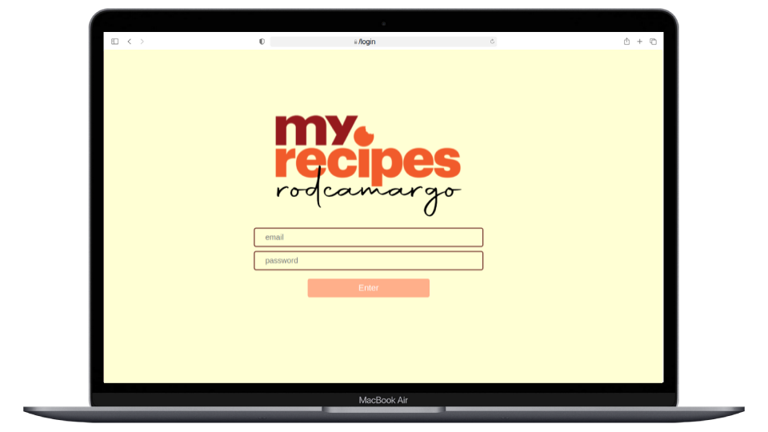

# :iphone: Recipes App :tropical_drink:

## :pencil2: About/Sobre

  
<strong>:us: English</strong>
 

Front-End React group project developed by [Rodrigo Camargo](https://www.linkedin.com/in/rodrigocamargobr/), [Rharan Rufino](https://www.linkedin.com/in/rharan-ru/) and [Márcio Maciejenski](https://www.linkedin.com/in/marcio-maciejenski/) at the Front-End Module from the Trybe Web Development course. Approved with 100% of requirements met.

We developed a random recipe suggestions web app fetching for recipes data from the Edman's API. 

[Click here](https://rodcamargo-app-receitas.surge.sh/) to check out the final version of the project on your browser.

 

  
<strong>:brazil: Português</strong>
 

Projeto em grupo full stack React/Node.js desenvolvido por [Rodrigo Camargo](https://www.linkedin.com/in/rodrigocamargobr/), [Rharan Rufino](https://www.linkedin.com/in/rharan-ru/) e [Márcio Maciejenski](https://www.linkedin.com/in/marcio-maciejenski/) ao final do módulo de Front-End do curso de Desenvolvimento Web da Trybe. Aprovado com 100% dos requisitos atingidos.

Com o objetivo de desenvolver um aplicativo de receitas consumindo dados de uma API externa de Edman's API

[Clique aqui](https://rodcamargo-app-receitas.surge.sh/) para visualizar a aplicação em seu navegador.
 

## :man_technologist: Developed Skills/Habilidades Desenvolvidas

  
<strong>:us: English</strong>
 

* Coworking in group using agile methodologies
* Develop a Front-end application with React
* Create a brand new project from scratch using all the content we learned during the module
* Implement a responsive design with CSS flexbox.

 

  
<strong>:brazil: Português</strong>
 

* Trabalho colaborativo em grupo utilizando metodologias ágeis
* Criar uma aplicação Front-end utilizando React
* Criar uma aplicação utilizando todos os conhecimentos adquiridos durante o módule de Frond-end
* Implementar design responsivo com CSS flexbox.
 

## :hammer_and_wrench: Tools/Ferramentas

* HTML5
* CSS3
* JavaScript ES6+
* React JS
* Jest

## :trophy: Grade/Nota